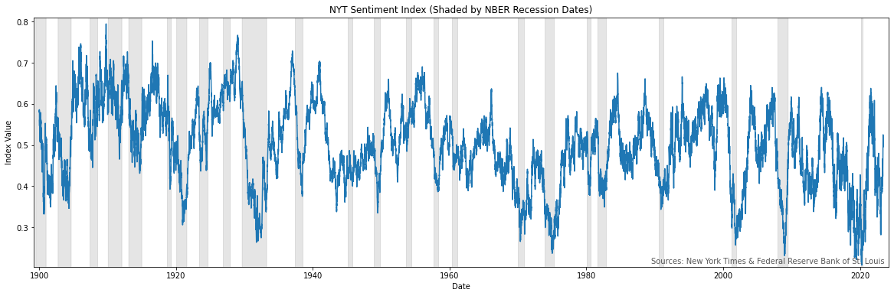

# NYT Sentiment Index

[](https://developer.nytimes.com)

This repository contains the source code used to create the New York Times Sentiment Index.

The New York Times Sentiment Index is a high frequency measure of economic sentiment based on classification of economics-related news articles. The index is based on all articles published in the New York Times since 1851. The index is updated daily and can be found [here](<URL-PLACEHOLDER>).

<p align="center">
  
  <br>
  <em>Figure 1: The chart shows moving average of NYT news sentiment values since 1900; higher values indicate more positive sentiment, and lower values indicate more negative sentiment. Gray bars indicate NBER recession dates.</em>
</p>

## Methodology

The construction of the index is achieved through the daily computation of a sentiment score, which is founded on an analysis of all economics-focused articles published by The New York Times each respective day. Each article is initially sorted into either the *Economic* or *Other* categories, utilizing a sophisticated topic classifier. Following this classification, a separate sentiment classifier evaluates each economics article, designating it as either *Positive*, *Neutral*, or *Negative*.

The sentiment score is subsequently computed through a process which involves quantifying the daily total of positive and negative headlines and applying the ensuing formula:

\[
\text{{Sentiment Score}} = \frac{{(\text{{Number of Positives}} - \text{{Number of Negatives}})}}{{(\text{{Number of Positives}} + \text{{Number of Negatives}})}}
\]​

The smoothed index, as demonstrated in Figure 1, is an outcome of implementing a 100-day exponential moving average, and subsequently detrending it by subtracting a 10-year simple moving average. This technique allows for the normalization of any potential fluctuations that could be attributed to evolving journalistic behaviors."

### Models

To classify each headline, two models are employed: [Topic-xDistil](https://huggingface.co/hakonmh/topic-xdistil-uncased) and [Sentiment-xDistil](https://huggingface.co/hakonmh/sentiment-xdistil-uncased). Both models are fine tuned transformers based on [`xtremedistil-l12-h384-uncased`](https://huggingface.co/microsoft/xtremedistil-l12-h384-uncased), a model originally published by Microsoft. These models were fine-tuned on specifically labelled datasets consisting of 300,000 and 600,000 headlines, respectively. The source code employed for fine-tuning both models can be accessed [here](https://github.com/hakonmh/distilnews).

### Data

The data used to create the index was gathered through the use of [The New York Times API](https://developer.nytimes.com/).
It is plausible to construct similar indices derived from other news sources. However, The New York Times archive offers a distinct advantage due to its comprehensive historical range, coupled with its accessible format.

## Citation

If you republish or redistribute any part of this work, please acknowledge its source by including
the following citation:`

```text
Håkon Magne Holmen. 2023. New York Times Sentiment Index. Version 0.1.0 [Source code]. https://github.com/hakonmh/NYT-Sentiment-Index
```
