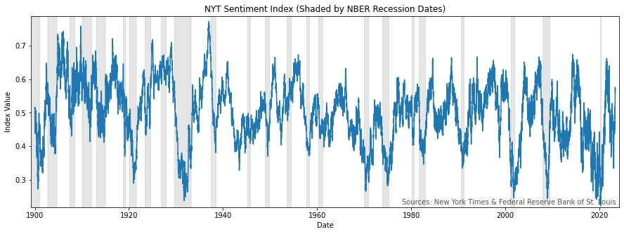

# NYT Sentiment Index

[](https://developer.nytimes.com)

This repository contains the source code used to create the New York Times Sentiment Index.

The New York Times Sentiment Index is a high frequency measure of economic sentiment based
on classification of economics-related news articles. The index is based on all articles
published in the New York Times since 1851. The index is updated with new data on a daily basis
and can be found [here](https://www.hakholm.com/nyt-sentiment-index).

<p align="center">
  
  <br>
  <em>Figure 1: The chart shows moving average of NYT news sentiment values since 1900; higher
  values indicate more positive sentiment, and lower values indicate more negative sentiment.
  Gray bars indicate NBER recession dates.</em>
</p>

## Methodology

The construction of the index is achieved through the computation of a daily sentiment score,
which is based on an analysis of all articles published by The New York Times each respective day.

The first step is to analyze each article published that day by employing a two-step classification
process. First, a fined tuned transformer model classifies article into either the *Economic* or *Other*
category. Second, each article classified as *Economic* is classified by a second transformer
as either *Positive*, *Neutral*, or *Negative* based on its sentiment.

The second step is to compute a sentiment score for each day, which is done by comparing the number
of *Positive* and *Negative* headlines. *Neutral* headlines are simply ignored.

The sentiment score is computed by:

1. Counting the number of headlines tagged *Positive* ($N_{pos}$)
and *Negative* ($N_{neg}$).
2. Applying the formula:

```math
\text{Sentiment} = \frac{N_{pos} - N_{neg}}{N_{pos} + N_{neg}}
```

Where $N$ is the number of *Economic* headlines classified as either *Positive* or *Negative*.

The final index, as demonstrated in *Figure 1*, is made by smoothing the sentiment score with
a 100-day exponential moving average, and subsequently detrending it by subtracting a 7-year
simple moving average, and adding a constant $0.5$. This technique allows for the removal of any long
term fluctuations that could be attributed to evolving journalistic behaviors (e.g., the increasing
prominence of negative news of all forms in the social media era), without compromising the
index’s ability to capture sentiment throughout a business cycle (Usually 5-7 years).

### Models

To classify each headline, two models are employed:

- [`Topic-xDistil`](https://huggingface.co/hakonmh/topic-xdistil-uncased)
- [`Sentiment-xDistil`](https://huggingface.co/hakonmh/sentiment-xdistil-uncased)

Both models are fine tuned transformers based on
[`xtremedistil-l12-h384-uncased`](https://huggingface.co/microsoft/xtremedistil-l12-h384-uncased),
a model originally published by Microsoft. These models were fine-tuned on labelled
datasets consisting of *300,000* and *600,000* headlines, respectively. The source code employed for
fine-tuning both models can be accessed [here](https://github.com/hakonmh/distilnews).

### Data

The data used to create the index was gathered through the use of
[The New York Times API](https://developer.nytimes.com/).
It is plausible to construct similar indices derived from other news sources. However, The New York
Times archive offers a distinct advantage due to its comprehensive historical range, coupled with its
accessible format.

## Citation

If you republish or redistribute any part of this work, please acknowledge its source by including
the following citation:`

```text
Håkon Magne Holmen. 2023. New York Times Sentiment Index. Version 0.1.0 https://github.com/hakonmh/NYT-Sentiment-Index
```

## Running the Code

Clone the repository and install the required packages:

```bash
git clone https://github.com/hakonmh/NYT-Sentiment-Index.git
cd NYT-Sentiment-Index
pip install -r requirements.txt
```

Get a New York Times API-key at [https://developer.nytimes.com/](https://developer.nytimes.com/).
You can use the API-key by either setting the `NYT_API_KEY` environment variable or changing the
`NYT_API_KEY` variable found in `download.py`

Finally, run the `main.py` script:

```bash
python main.py
```

It should be noted that the New York Times API has a limit of 500 requests per day, meaning just
500 months of data can be downloaded per day. The script will crash once this limit is reached.
However, the script will start from where it left of when called again next time. You can change
the start date in `main.py` to download a shorter version of the index for testing purposes.
